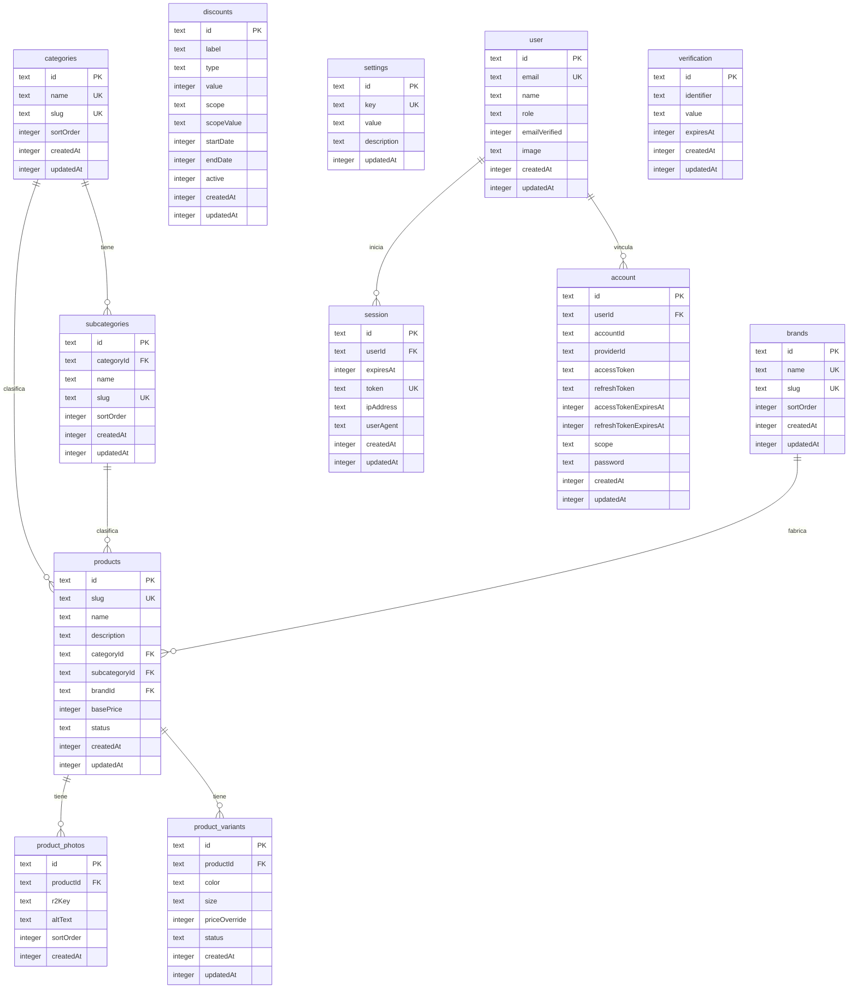

# Saris — Modelo de Datos

**Versión:** 1.0
**Fecha:** 18 de abril de 2026
**Stack:** Astro + Cloudflare D1 (SQLite) + Drizzle ORM

---

## Diagrama Entidad-Relación



---

## Tablas

### `categories` — Categorías

Catálogo predefinido de categorías de productos. Solo el administrador puede modificarlo.

| Campo | Tipo SQLite | Restricciones | Descripción |
|---|---|---|---|
| `id` | `TEXT` | `PRIMARY KEY` | CUID2 generado en la aplicación |
| `name` | `TEXT` | `NOT NULL UNIQUE` | Nombre de la categoría |
| `slug` | `TEXT` | `NOT NULL UNIQUE` | Slug para URL amigable (ej. `ropa-deportiva`) |
| `sortOrder` | `INTEGER` | `NOT NULL DEFAULT 0` | Orden de visualización en el catálogo |
| `createdAt` | `INTEGER` | `NOT NULL` | Timestamp Unix (ms) |
| `updatedAt` | `INTEGER` | `NOT NULL` | Timestamp Unix (ms) |

---

### `subcategories` — Subcategorías

Cada subcategoría pertenece a exactamente una categoría.

| Campo | Tipo SQLite | Restricciones | Descripción |
|---|---|---|---|
| `id` | `TEXT` | `PRIMARY KEY` | CUID2 generado en la aplicación |
| `categoryId` | `TEXT` | `NOT NULL REFERENCES categories(id)` | Categoría padre |
| `name` | `TEXT` | `NOT NULL` | Nombre de la subcategoría |
| `slug` | `TEXT` | `NOT NULL UNIQUE` | Slug para URL amigable |
| `sortOrder` | `INTEGER` | `NOT NULL DEFAULT 0` | Orden de visualización |
| `createdAt` | `INTEGER` | `NOT NULL` | Timestamp Unix (ms) |
| `updatedAt` | `INTEGER` | `NOT NULL` | Timestamp Unix (ms) |

**Índices:** `categoryId`

---

### `brands` — Marcas

Catálogo predefinido de marcas.

| Campo | Tipo SQLite | Restricciones | Descripción |
|---|---|---|---|
| `id` | `TEXT` | `PRIMARY KEY` | CUID2 generado en la aplicación |
| `name` | `TEXT` | `NOT NULL UNIQUE` | Nombre de la marca |
| `slug` | `TEXT` | `NOT NULL UNIQUE` | Slug para URL amigable |
| `sortOrder` | `INTEGER` | `NOT NULL DEFAULT 0` | Orden de visualización |
| `createdAt` | `INTEGER` | `NOT NULL` | Timestamp Unix (ms) |
| `updatedAt` | `INTEGER` | `NOT NULL` | Timestamp Unix (ms) |

---

### `products` — Productos

Registro maestro de cada producto. Agrupa todas sus variantes y fotos.

| Campo | Tipo SQLite | Restricciones | Descripción |
|---|---|---|---|
| `id` | `TEXT` | `PRIMARY KEY` | CUID2 generado en la aplicación |
| `slug` | `TEXT` | `NOT NULL UNIQUE` | Slug para URL SEO-friendly (ej. `playera-nike-azul`) |
| `name` | `TEXT` | `NOT NULL` | Nombre del producto |
| `description` | `TEXT` | `NOT NULL` | Descripción del producto |
| `categoryId` | `TEXT` | `NOT NULL REFERENCES categories(id)` | Categoría del producto |
| `subcategoryId` | `TEXT` | `NOT NULL REFERENCES subcategories(id)` | Subcategoría del producto |
| `brandId` | `TEXT` | `NOT NULL REFERENCES brands(id)` | Marca del producto |
| `basePrice` | `INTEGER` | `NOT NULL` | Precio base en centavos (IVA incluido). Ej: $199.90 → `19990` |
| `status` | `TEXT` | `NOT NULL DEFAULT 'active'` | `'active'` o `'inactive'` |
| `createdAt` | `INTEGER` | `NOT NULL` | Timestamp Unix (ms) |
| `updatedAt` | `INTEGER` | `NOT NULL` | Timestamp Unix (ms) |

**Índices:** `categoryId`, `subcategoryId`, `brandId`, `status`, `createdAt`

**Nota sobre precio:** Se almacena en centavos como entero para evitar errores de punto flotante. La capa de presentación divide entre 100 para mostrar el precio formateado.

---

### `product_photos` — Fotos del Producto

Las fotos pertenecen al producto, no a variantes individuales. Un producto puede tener entre 1 y 3 fotos.

| Campo | Tipo SQLite | Restricciones | Descripción |
|---|---|---|---|
| `id` | `TEXT` | `PRIMARY KEY` | CUID2 generado en la aplicación |
| `productId` | `TEXT` | `NOT NULL REFERENCES products(id) ON DELETE CASCADE` | Producto al que pertenece |
| `r2Key` | `TEXT` | `NOT NULL` | Clave del objeto en Cloudflare R2 (ruta del archivo) |
| `altText` | `TEXT` | | Texto alternativo para accesibilidad y SEO |
| `sortOrder` | `INTEGER` | `NOT NULL DEFAULT 0` | Orden de visualización (la foto con `sortOrder = 0` es la principal) |
| `createdAt` | `INTEGER` | `NOT NULL` | Timestamp Unix (ms) |

**Índices:** `productId`

**Restricción de negocio:** La aplicación valida que no existan más de 3 fotos por producto antes de insertar.

---

### `product_variants` — Variantes del Producto

Una variante representa una combinación específica de color y/o talla dentro de un producto. Si el producto no tiene variaciones, existe una sola variante con `color = NULL` y `size = NULL`.

| Campo | Tipo SQLite | Restricciones | Descripción |
|---|---|---|---|
| `id` | `TEXT` | `PRIMARY KEY` | CUID2 generado en la aplicación |
| `productId` | `TEXT` | `NOT NULL REFERENCES products(id) ON DELETE CASCADE` | Producto padre |
| `color` | `TEXT` | | Color de esta variante (ej. `"Azul marino"`) |
| `size` | `TEXT` | | Talla de esta variante (ej. `"M"`, `"42"`) |
| `priceOverride` | `INTEGER` | | Precio en centavos. Si es `NULL`, se usa `products.basePrice` |
| `status` | `TEXT` | `NOT NULL DEFAULT 'active'` | `'active'` o `'inactive'` |
| `createdAt` | `INTEGER` | `NOT NULL` | Timestamp Unix (ms) |
| `updatedAt` | `INTEGER` | `NOT NULL` | Timestamp Unix (ms) |

**Índices:** `productId`, `color`, `size`

**Lógica de precio:** precio efectivo = `priceOverride ?? product.basePrice`. Los descuentos siempre se calculan sobre el precio efectivo de la variante.

---

### `discounts` — Descuentos

Sistema de descuentos con alcance configurable. Un registro puede aplicar a un producto individual, a toda una categoría, a todos los productos de una marca, etc.

| Campo | Tipo SQLite | Restricciones | Descripción |
|---|---|---|---|
| `id` | `TEXT` | `PRIMARY KEY` | CUID2 generado en la aplicación |
| `label` | `TEXT` | `NOT NULL` | Nombre descriptivo del descuento (ej. `"Verano 2026"`) |
| `type` | `TEXT` | `NOT NULL` | `'percentage'` o `'fixed_amount'` |
| `value` | `INTEGER` | `NOT NULL` | Para `percentage`: valor de 1 a 100. Para `fixed_amount`: monto en centavos |
| `scope` | `TEXT` | `NOT NULL` | Nivel de aplicación: `'all'`, `'product'`, `'category'`, `'subcategory'`, `'brand'`, `'color'`, `'size'` |
| `scopeValue` | `TEXT` | | ID o valor al que aplica. `NULL` si `scope = 'all'`. Para `color` y `size` es el valor literal |
| `startDate` | `INTEGER` | | Timestamp Unix (ms). `NULL` = activo de inmediato |
| `endDate` | `INTEGER` | | Timestamp Unix (ms). `NULL` = sin fecha de fin |
| `active` | `INTEGER` | `NOT NULL DEFAULT 1` | `1` = activo, `0` = desactivado manualmente |
| `createdAt` | `INTEGER` | `NOT NULL` | Timestamp Unix (ms) |
| `updatedAt` | `INTEGER` | `NOT NULL` | Timestamp Unix (ms) |

**Índices:** `scope`, `active`, `startDate`, `endDate`

**Algoritmo de resolución del descuento aplicable:**

```
Dado un producto con categoryId, subcategoryId, brandId y una variante con color, size:

1. Consultar todos los discounts donde:
   active = 1
   Y (startDate IS NULL OR startDate <= now)
   Y (endDate IS NULL OR endDate >= now)
   Y (
       scope = 'all'
       OR (scope = 'product'     AND scopeValue = product.id)
       OR (scope = 'category'    AND scopeValue = product.categoryId)
       OR (scope = 'subcategory' AND scopeValue = product.subcategoryId)
       OR (scope = 'brand'       AND scopeValue = product.brandId)
       OR (scope = 'color'       AND scopeValue = variant.color)
       OR (scope = 'size'        AND scopeValue = variant.size)
   )

2. De los descuentos que califican, seleccionar el de mayor valor efectivo:
   - percentage:    valor_efectivo = precio × (value / 100)
   - fixed_amount:  valor_efectivo = value (en centavos)

3. Precio final = precio_efectivo_variante - descuento_mayor
```

---

### `settings` — Configuración del Sitio

Almacén clave-valor para configuración global del sitio.

| Campo | Tipo SQLite | Restricciones | Descripción |
|---|---|---|---|
| `id` | `TEXT` | `PRIMARY KEY` | CUID2 generado en la aplicación |
| `key` | `TEXT` | `NOT NULL UNIQUE` | Identificador de la configuración |
| `value` | `TEXT` | | Valor de la configuración |
| `description` | `TEXT` | | Descripción legible para el administrador |
| `updatedAt` | `INTEGER` | `NOT NULL` | Timestamp Unix (ms) |

**Valores iniciales:**

| `key` | Ejemplo | Descripción |
|---|---|---|
| `whatsapp_number` | `5215512345678` | Número en formato internacional |
| `site_name` | `Saris` | Nombre del sitio |
| `site_tagline` | `Tu catálogo de moda` | Eslogan del sitio |

---

### Tablas de Better Auth

Better Auth gestiona la autenticación y requiere sus propias tablas. El campo `role` se agrega como campo adicional en `user`.

#### `user` — Usuarios

| Campo | Tipo | Restricciones | Descripción |
|---|---|---|---|
| `id` | `TEXT` | `PRIMARY KEY` | ID generado por Better Auth |
| `email` | `TEXT` | `NOT NULL UNIQUE` | Correo electrónico |
| `name` | `TEXT` | `NOT NULL` | Nombre completo |
| `role` | `TEXT` | `NOT NULL DEFAULT 'editor'` | `'admin'` o `'editor'` |
| `emailVerified` | `INTEGER` | `NOT NULL` | `1` = verificado |
| `image` | `TEXT` | | URL de foto de perfil |
| `createdAt` | `INTEGER` | `NOT NULL` | Timestamp Unix (ms) |
| `updatedAt` | `INTEGER` | `NOT NULL` | Timestamp Unix (ms) |

#### `session` — Sesiones

| Campo | Tipo | Restricciones | Descripción |
|---|---|---|---|
| `id` | `TEXT` | `PRIMARY KEY` | |
| `userId` | `TEXT` | `NOT NULL REFERENCES user(id) ON DELETE CASCADE` | |
| `expiresAt` | `INTEGER` | `NOT NULL` | Timestamp Unix (ms) |
| `token` | `TEXT` | `NOT NULL UNIQUE` | |
| `ipAddress` | `TEXT` | | |
| `userAgent` | `TEXT` | | |
| `createdAt` | `INTEGER` | `NOT NULL` | |
| `updatedAt` | `INTEGER` | `NOT NULL` | |

#### `account` — Cuentas vinculadas

| Campo | Tipo | Restricciones | Descripción |
|---|---|---|---|
| `id` | `TEXT` | `PRIMARY KEY` | |
| `userId` | `TEXT` | `NOT NULL REFERENCES user(id) ON DELETE CASCADE` | |
| `accountId` | `TEXT` | `NOT NULL` | ID en el proveedor externo |
| `providerId` | `TEXT` | `NOT NULL` | Ej. `"credential"` |
| `accessToken` | `TEXT` | | |
| `refreshToken` | `TEXT` | | |
| `accessTokenExpiresAt` | `INTEGER` | | |
| `refreshTokenExpiresAt` | `INTEGER` | | |
| `scope` | `TEXT` | | |
| `password` | `TEXT` | | Hash de contraseña |
| `createdAt` | `INTEGER` | `NOT NULL` | |
| `updatedAt` | `INTEGER` | `NOT NULL` | |

#### `verification` — Tokens de verificación

| Campo | Tipo | Restricciones | Descripción |
|---|---|---|---|
| `id` | `TEXT` | `PRIMARY KEY` | |
| `identifier` | `TEXT` | `NOT NULL` | Email u otro identificador |
| `value` | `TEXT` | `NOT NULL` | Token de verificación |
| `expiresAt` | `INTEGER` | `NOT NULL` | |
| `createdAt` | `INTEGER` | | |
| `updatedAt` | `INTEGER` | | |

---

## Decisiones de Diseño

### 1. Precios en centavos como entero

Todos los precios se almacenan en centavos (`INTEGER`) en lugar de `REAL`. Esto evita errores de redondeo de punto flotante en SQLite. Ejemplo: $199.90 MXN → `19990`. La presentación divide entre 100.

### 2. Modelo producto → variante

- **Producto sin variantes:** una sola variante con `color = NULL` y `size = NULL`.
- **Variantes con precio igual:** `priceOverride = NULL`, heredan `basePrice`.
- **Variantes con precio distinto:** las variantes especiales llevan `priceOverride`.
- **Fotos compartidas:** las fotos viven en `product_photos` vinculadas al producto, no a la variante.

### 3. Sistema de descuentos por alcance (`scope`)

Columna polimórfica `scope` + `scopeValue` en lugar de tablas relacionales por tipo. Mantiene la tabla simple y permite nuevos tipos de alcance sin migraciones adicionales.

### 4. IDs como CUID2 en texto

- No revelan secuencia ni volumen de registros.
- Seguros para URLs sin codificación adicional.
- Se generan en la capa de aplicación antes de insertar.

### 5. Timestamps como INTEGER (Unix ms)

SQLite no tiene tipo `DATETIME` nativo. Se usan enteros en milisegundos Unix, compatibles con `Date.now()` en JavaScript y con el modo `{ mode: 'timestamp_ms' }` de Drizzle ORM.

### 6. Slugs únicos globalmente

Los slugs de todas las entidades son únicos a nivel global. Simplifica el enrutamiento en Astro. Para productos, se genera a partir del nombre (normalizado) con sufijo aleatorio corto en caso de colisión.

### 7. Eliminación en cascada

`product_photos` y `product_variants` usan `ON DELETE CASCADE`. Al eliminar un producto, la aplicación debe limpiar los archivos en R2 antes de eliminar el registro en la base de datos.

### 8. Campo `role` en `user` de Better Auth

Se agrega `role` directamente a la tabla `user` mediante `additionalFields` de Better Auth. Solo hay dos roles fijos (`admin`, `editor`), por lo que una tabla de roles separada sería innecesaria.
